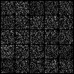

# GAN 

Generative Adversarial Networks([논문](https://arxiv.org/pdf/1406.2661.pdf))

## dataset

MNIST

## model discription 

simple model

* genetator : 2 linear layers (last activation : tanh)

* discriminator : 2 linear layers (last activation : sigmoid)

* loss : MSE

## result

generator loss : 0.29, discrimination loss : 0.59

### 학습이 잘 되지는 않음

1. 처음부터 끝까지 loss거의 변하지 않음(loss정체되어있음)

    

2. 이 모델에서는 잘 된다고 하더라도 0~9까지 모두 생성할 수 있게 되지 않고, 0이나 1만 만든다던지 함

### 학습이 잘 되지 않은 이유

1. 둘 중에 하나만이라도 더 학습을 잘 한다면 잘 학습이 안됨
 * 보통 generator보다 discriminator가 더 학습을 잘함 - 그래서 학습이 정체가 될 수 있음
2. 네트워크 자체가 너무 단순했음
  
~~~ 
mkdir result
mkdir model
