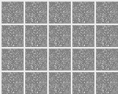

# DCGAN

  Unsupervised Representation Learning with Deep Convolutional Generative Adversarial Networks([논문](https://arxiv.org/pdf/1511.06434.pdf))
 
## dataset

MNIST
 
## result

 
 
 GAN보다는 형태를 갖춘 이미지들
 
 loss를 MSE로 했지만,BCE로 하면 더 좋을 것(쓸데없는 noise없을 것)
 
## 문제

시간이 너무 많이 걸림(사이즈가 큰 모델이라서)
 
 ~~~ 
 mkdir result
 mkdir model
