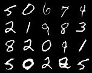

# InfoGAN

InfoGAN: Interpretable Representation Learning by Information Maximizing Generative Adversarial Nets([논문](https://arxiv.org/pdf/1606.03657.pdf))

infogan_catcon.ipynb 돌리기 (onlycat은 문제가 있음)

## result

## Parameter Setting

Noise z: 62  
Discrete: 10  
Continuous: 2  
lambda: 0.75  

~~~
mkdir result_catcon
mkdir result_contin
mkdir model
